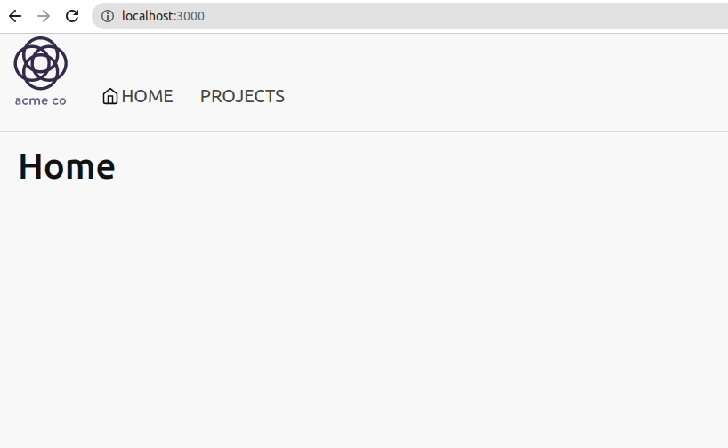
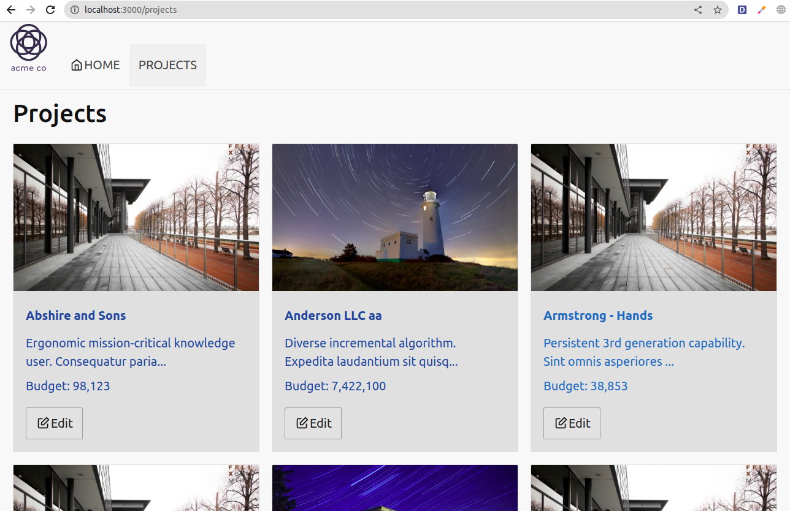
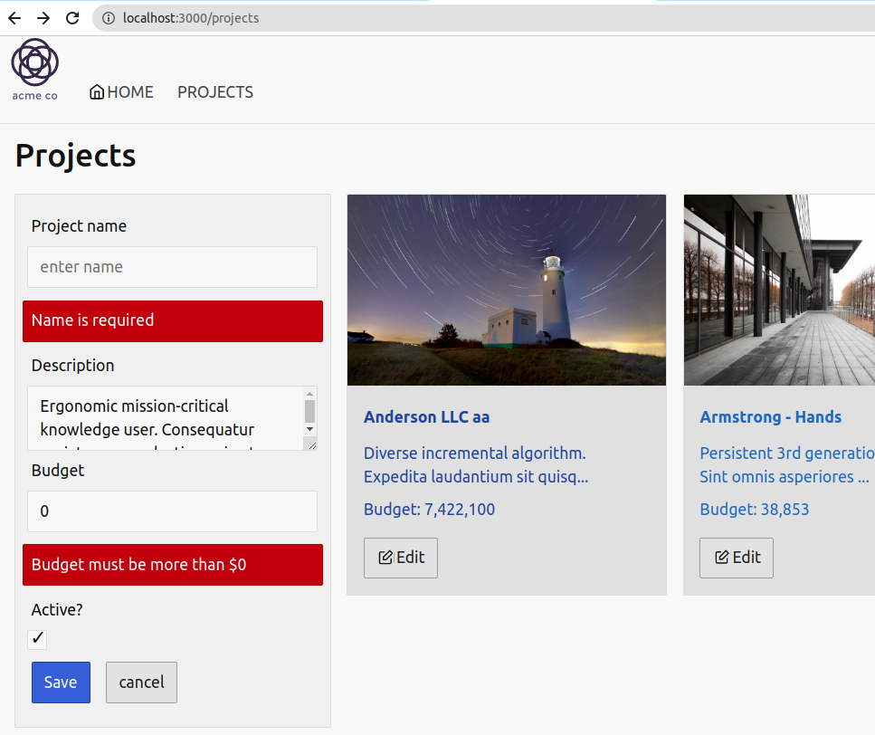
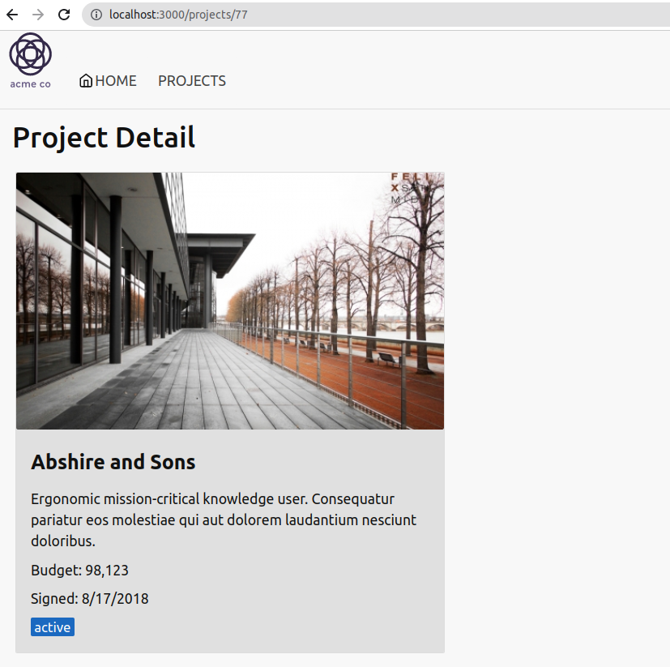

# Keeptrack Tutorial

## Guideline Page
https://handsonreact.com/docs/labs/react-tutorial-typescript

## Install
```sh
npm run api
npm start
```

## Demo
| Page name | Screenshot |
| - | - |
| Home page |  |
| Projects list |  |
| Edit project |  |
| Project detail |  |
